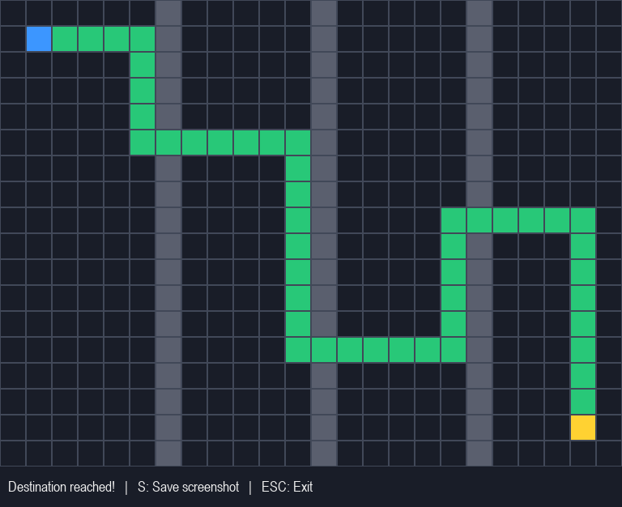

# 🤖 AI-Based Autonomous Navigation System

An intelligent robot navigation simulation built using Python, Pygame, and the A* pathfinding algorithm. The system finds an efficient path from a starting position to a goal while avoiding obstacles in a grid-based environment.

## 📌 Project Overview

The AI-Based Autonomous Navigation System demonstrates how an autonomous robot can navigate a virtual environment using path planning and obstacle avoidance.

The project visualizes the planned route, simulates robot movement, and records navigation performance metrics for analysis.

## ✨ Features

- **A* Pathfinding Algorithm:** Finds a valid path from the start to the goal.
- **Obstacle Avoidance:** Plans a route around blocked grid cells.
- **Visual Robot Simulation:** Displays robot movement using Pygame.
- **Grid-Based Environment:** Represents free spaces and obstacles in a 2D map.
- **Navigation Metrics:** Saves performance details in JSON format.
- **Screenshot Capture:** Saves a simulation screenshot.
- **Unit Testing:** Tests pathfinding behavior and obstacle handling.

## 🛠️ Technologies Used

- Python
- Pygame
- A* Search Algorithm
- JSON
- Python `unittest`

## 📂 Project Structure

```text
AI-Based-Autonomous-Navigation-System/
│
├── main.py
├── planner.py
├── simulation.py
├── metrics.py
├── requirements.txt
├── README.md
├── .gitignore
│
├── tests/
│   └── test_planner.py
│
├── outputs/
│   ├── metrics.json
│   └── navigation_screenshot.png
│
├── docs/
│   └── project-notes.md
│
└── assets/
```

## ⚙️ Installation and Setup

### 1. Clone the Repository

```bash
git clone https://github.com/YOUR-USERNAME/AI-Based-Autonomous-Navigation-System.git
```

Replace `YOUR-USERNAME` with your GitHub username.

### 2. Open the Project Folder

```bash
cd AI-Based-Autonomous-Navigation-System
```

### 3. Create a Virtual Environment

```bash
python -m venv .venv
```

Activate it on Windows CMD:

```cmd
.venv\Scripts\activate.bat
```

### 4. Install Dependencies

```bash
python -m pip install -r requirements.txt
```

If dependencies are not listed in `requirements.txt`, install them using:

```bash
python -m pip install pygame numpy matplotlib
```

### 5. Run the Application

```bash
python main.py
```

The application will calculate a path and open the robot navigation simulation.

## 🧪 Run Unit Tests

Run the test suite using:

```bash
python -m unittest discover -s tests -p "test_*.py" -v
```

The project has successfully passed four unit tests in the development environment.

## 📊 Sample Navigation Results

The following are sample results from a successful simulation run:

| Metric | Result |
|---|---|
| Algorithm | A* |
| Start Position | (1, 1) |
| Goal Position | (16, 22) |
| Path Cells | 47 |
| Number of Steps | 46 |
| Collision Count | 0 |
| Navigation Status | SUCCESS |
| Movement Model | 4-direction grid movement |

Planning time and elapsed simulation time may vary between runs.

## 📈 Performance Metrics

The `metrics.py` module saves navigation results to:

```text
outputs/metrics.json
```

The output contains:

- Timestamp
- Pathfinding algorithm
- Start and goal coordinates
- Navigation status
- Number of path cells and steps
- Collision count
- Elapsed time
- Movement model

## 🖼️ Simulation Screenshot

After running the application, the simulation screenshot is saved at:

```text
outputs/navigation_screenshot.png
```

You can add the screenshot to this README after uploading it to the repository.

```markdown

```

## 🧠 How It Works

1. Create a grid-based environment.
2. Define the robot's starting position and destination.
3. Use the A* algorithm to calculate a valid path.
4. Avoid obstacles while planning the route.
5. Visualize the path and robot movement using Pygame.
6. Save navigation metrics as a JSON file.
7. Run unit tests to validate pathfinding behavior.

## 🎯 Learning Outcomes

- Understanding heuristic-based pathfinding.
- Implementing A* search in Python.
- Simulating autonomous navigation.
- Handling obstacles in a grid environment.
- Recording and analyzing performance metrics.
- Writing automated unit tests.

## 🚀 Future Enhancements

- Dynamic obstacle detection.
- Real-time replanning.
- Interactive obstacle placement.
- Comparison of A*, Dijkstra's algorithm, and BFS.
- Performance graphs and analytics dashboard.
- Integration with a physical robot or robotics simulator.

## ⚠️ Limitations

This project currently uses a virtual grid-based simulation. It does not control a physical robot or use real-world sensors.

## 👩‍💻 Author

**Vinotha**

Aspiring AI and Technology Professional

## 📄 License

This project is intended for educational and learning purposes. A formal open-source license can be added to the repository if required.
